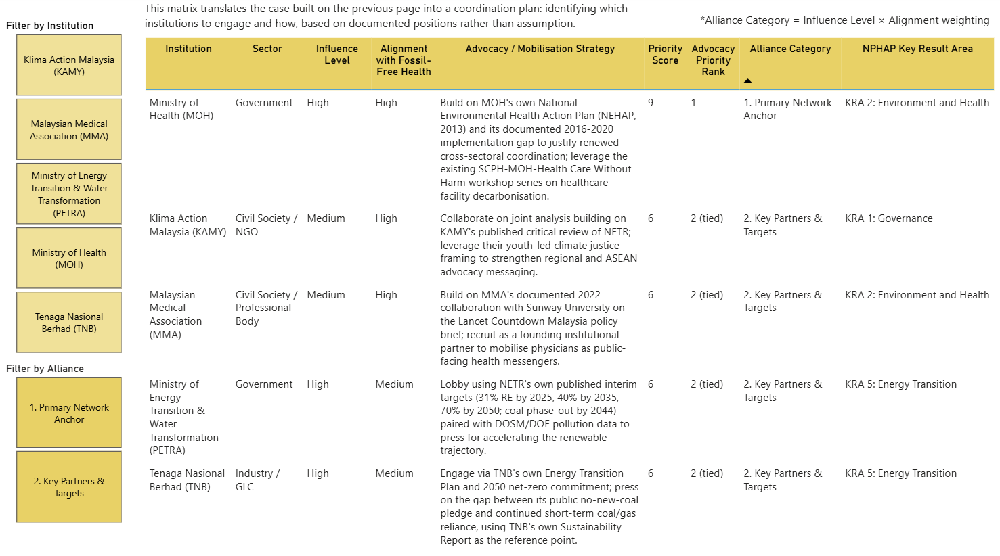

# Malaysia Health-Centred Decarbonisation Dashboard

An interactive Power BI analysis examining the gap between Malaysia's energy transition trajectory and its public health outcomes; built to identify where national energy policy and planetary health policy are and are not currently aligned.

## The Question

Is Malaysia's energy transition actually accounting for health, or just carbon and cost?

## Key Findings

- Malaysia's ambient air quality has breached WHO's 2021 annual safety guideline (5 µg/m³ PM2.5) every year on record, 2018–2022.
- Sulfur dioxide (SO₂): the pollutant most directly linked to coal combustion remains within Malaysia's own regulatory limit but has trended upward since 2020, even as PM2.5 stabilised.
- Malaysia reached 32% renewable installed capacity in 2025, slightly ahead of its own 31% NETR target; genuine, on-schedule progress.
- Even so, coal is not fully phased out until 2044, and full renewable capacity (70%) is not targeted until 2050. This means the air quality burden documented above will persist for two more decades without an accelerated pace.

## Dashboard

**Page 1 — The Problem**

**Page 2 — The Strategy**

## Stakeholder Engagement Matrix

Five institutions — spanning government, industry and civil society are mapped to Malaysia's National Planetary Health Action Plan (NPHAP) Key Result Areas. Influence and alignment are scored using a methodology adapted from Mendelow's Power-Interest framework, with each classification grounded in a documented public position or precedent rather than assumption. Full sourcing in [sources.md](sources.md).

## Data Sources

- Department of Statistics Malaysia (DOSM) — Air Pollution dataset (open.dosm.gov.my)
- Suruhanjaya Tenaga (Energy Commission Malaysia) — Malaysia Energy Statistics Handbook
- Sustainable Energy Development Authority (SEDA) Malaysia
- WHO Global Air Quality Guidelines, 2021
- National Energy Transition Roadmap (NETR), Ministry of Economy, 2023
- National Planetary Health Action Plan (NPHAP), Academy of Sciences Malaysia, 2025
- National Environmental Health Action Plan (NEHAP), Ministry of Health Malaysia, 2013
- The Lancet Countdown on Health and Climate Change: Policy Brief for Malaysia, Sunway University, 2022
- TNB Sustainability Report, 2024
- Klima Action Malaysia (KAMY), NETR analysis, 2023

Full citations, including direct source links, are listed in [sources.md](sources.md).

## Tools

Power BI · Power Query · DAX

## Methodology Note

Every figure in this dashboard was cross-checked against a primary or authoritative regulatory source before inclusion. Where secondary sources or earlier drafts contained inconsistencies — including a mislabelled coal phase-out date and an incorrectly attributed renewable energy statistic — these were identified and corrected against primary data during development.

## Author

Ajeerah Azali
[LinkedIn] · [Email]

---
*Underlying government datasets used in this project are published under Malaysia's Creative Commons Attribution 4.0 International License (CC BY 4.0).*
